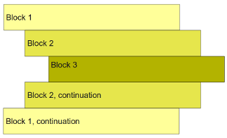

# Indentation

- One unusual Python feature is that the whitespace indentation of a piece of code affects its meaning
- A logical block of statements such as the ones that make up a function should all have the same indentation, set in from the indentation of their parent function or “if” or whatever. If one of the lines in a group has a different indentation, it is flagged as a syntax error.
- Indentation. Standard is to use four spaces and not tabs(or use tabs that are set to spaces)
- Indent to begin a block, dedent to end one.



```
for ip_address in target_list:
    if port = 'open'
        print "The port is open!"
    elif port != 'open':
        print "Port is closed"
    else:
        print "Port is filtered"

```