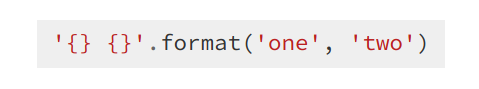
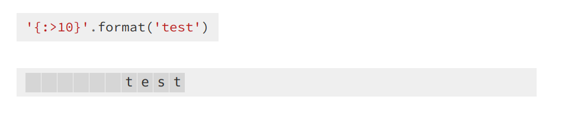
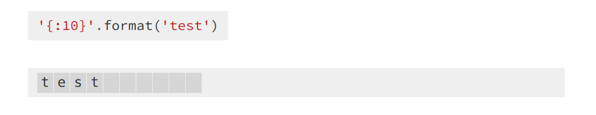
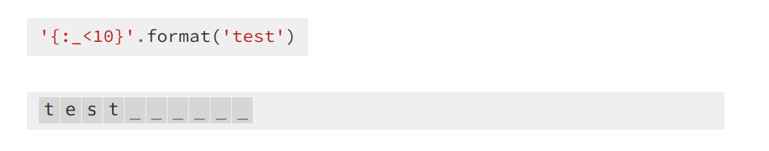

# Printing

- Python has had awesome string formatters that make printing simpler and elegant
- The string `format()` method formats the given string into a nicer output in Python

**Reference** https://pyformat.info/

## Basic usage

- The "fields to be replaced" are surrounded by curly braces `{}`.  `'{} {}'.format('one', 'two')`



```
>>> print "[+] Port num: {} on host {} is open.".format(port_number, hostname)
```

- Keywords can be used to index parameters as well.(Named placeholders)

```
>>> "Art: {a:5d},  Price: {p:8.2f}".format(a=453, p=59.058)
'Art:   453,  Price:    59.06'
```

## Padding and aligning strings

- By default, values are formatted to take up only as many characters as needed to represent the content. It is however also possible to define that a value should be padded to a specific length
- We can precede the formatting with a “<” (left justify) or “>” (right justify)




```
>>> '{:>10}'.format('test')                             # right align
'      test'
```




```
>>> "{0:<20s} {1:6.2f}".format('Spam & Eggs:', 6.99)    # left align
'Spam & Eggs:           6.99'
>>>
>>>'{:^10}'.format('test')                          #center align
'   test   '
```

- Using custom character for padding `'{:_<10}'.format('test')`



```
>>> '{:_<10}'.format('test')
'test______'
```